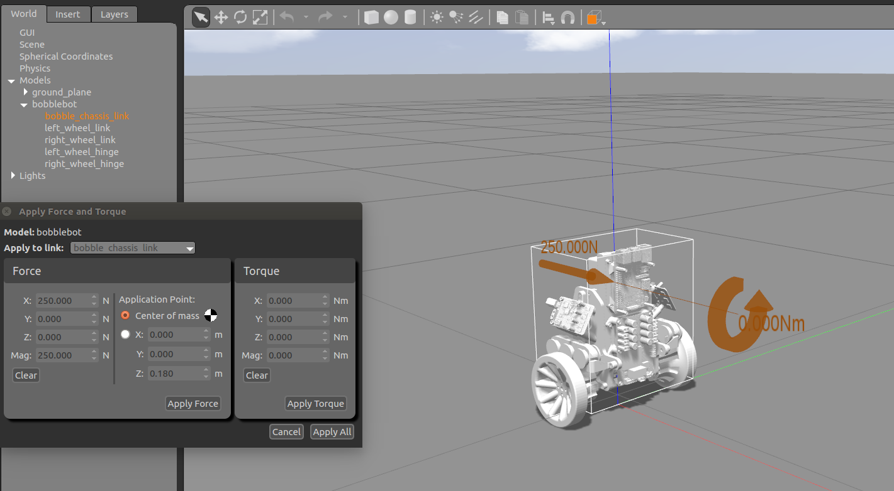

# BobbleBot Description Package

> A comprehensive ROS2 package containing URDF/Xacro files, 3D meshes, and launch files for the BobbleBot self-balancing robot simulation in Gazebo.

<a href="http://www.youtube.com/watch?feature=player_embedded&v=hS7kfhN-8V8" 
target="_blank"></a>

## Table of Contents

- [Overview](#overview)
- [Robot Description](#robot-description)
- [Dependencies](#dependencies)
- [Package Structure](#package-structure)
- [Launch Files](#launch-files)
- [Configuration](#configuration)
- [Build Instructions](#build-instructions)
- [Usage Examples](#usage-examples)
- [Troubleshooting](#troubleshooting)
- [Migration Information](#migration-information)

## Overview

The `bobble_description` package provides the complete robot description for BobbleBot, a self-balancing two-wheeled robot. This package contains:

- **URDF/Xacro files**: Complete robot description including sensors, actuators, and gazebo plugins
- **3D Meshes**: STL files for visual representation of robot components
- **Launch files**: Python launch files for different simulation scenarios
- **Configuration files**: ROS2 controller configuration for robot control
- **World files**: Gazebo world environments for simulation

**Package Information:**
- **Version**: 1.0.0
- **Maintainer**: Mike Moore (mike.moore@so.engineering)
- **License**: BSD
- **Build System**: ament_cmake (ROS2)

## Robot Description

### Physical Components

BobbleBot consists of the following main components:

1. **Chassis**: Main structural frame (grey and orange variants)
2. **Wheels**: Two differential drive wheels (left and right)
3. **Battery**: Power supply component
4. **Electronics**: Control electronics housing
5. **RealSense Camera**: Intel RealSense depth camera
6. **IMU Sensor**: BNO055 inertial measurement unit

### Sensor Suite

- **IMU**: BNO055 sensor providing orientation and angular velocity data
  - Topic: `/bobble/imu_bosch/data_raw`
  - Update Rate: 200 Hz
  - Gaussian Noise: 0.02
- **Camera**: Intel RealSense depth camera (configurable)
- **Wheel Encoders**: Integrated with differential drive controller

### Actuators

- **Differential Drive**: Two-wheel drive system
  - Wheel Separation: 0.16m
  - Wheel Radius: 0.0325m
  - Control via `/bobble/cmd_vel` topic

## Dependencies

### Build Dependencies
- `ament_cmake`
- `gazebo_ros2_control`
- `gazebo_ros_pkgs`
- `robot_state_publisher`

### Runtime Dependencies
- `gazebo_ros2_control`
- `ros_gz_bridge`
- `ros_gz_image`
- `ros_gz_sim`
- `robot_state_publisher`
- `launch`
- `launch_ros`

### External Dependencies
- **Gazebo**: For physics simulation
- **ROS2 Control**: For robot control interface
- **Xacro**: For URDF processing

## Package Structure

```
bobble_description/
├── CMakeLists.txt              # Build configuration
├── package.xml                 # Package metadata and dependencies
├── README.md                   # This file
├── LICENSE                     # BSD license
├── MigrationPlan.md           # ROS1 to ROS2 migration documentation
├── config/
│   └── ros2_controllers.yaml  # ROS2 controller configuration
├── imgs/
│   └── BobbleBotGazebo.png    # Documentation image
├── launch/
│   ├── bobble.launch.py       # Basic robot launch (existing Gazebo)
│   └── bobble_sim.launch.py   # Complete simulation launch
├── meshes/                    # 3D model files
│   ├── battery.stl
│   ├── chassis_grey.stl
│   ├── chassis_orange.stl
│   ├── electronics.stl
│   ├── realsense.stl
│   └── wheel.stl
├── worlds/
│   └── empty_world.world      # Default Gazebo world
└── xacro/                     # Robot description files
    ├── bobble.urdf.xacro      # Main robot assembly
    ├── bobble_world.urdf.xacro # World-ready robot description
    ├── bobble_battery.urdf.xacro
    ├── bobble_chassis.urdf.xacro
    ├── bobble_chassis2.urdf.xacro
    ├── bobble_electronics.urdf.xacro
    ├── bobble_realsense.urdf.xacro
    ├── bno055_imu.urdf.xacro
    ├── camera.urdf.xacro
    ├── left_wheel.urdf.xacro
    ├── right_wheel.urdf.xacro
    └── materials/
        └── materials.xacro     # Material definitions
```

## Launch Files

### 1. bobble_sim.launch.py (Complete Simulation)

**Purpose**: Launches a complete Gazebo simulation with the BobbleBot robot.

**Usage**:
```bash
ros2 launch bobble_description bobble_sim.launch.py
```

**Arguments**:
- `paused` (default: `false`): Start Gazebo in paused state
- `gui` (default: `true`): Start Gazebo with GUI
- `model` (default: `bobblebot`): Name of the robot model in Gazebo
- `world` (default: `empty_world.world`): Gazebo world file (filename or full path)
- `use_namespace` (default: `true`): Whether to use namespace for the robot
- `namespace` (default: `bobble`): Robot namespace
- `x_pos` (default: `0.0`): X position of robot spawn point
- `y_pos` (default: `0.0`): Y position of robot spawn point
- `z_pos` (default: `0.035`): Z position of robot spawn point (wheel radius + small margin)

**Example Commands**:
```bash
# Basic simulation with GUI
ros2 launch bobble_description bobble_sim.launch.py

# Start paused simulation
ros2 launch bobble_description bobble_sim.launch.py paused:=true

# Simulation without GUI (headless)
ros2 launch bobble_description bobble_sim.launch.py gui:=false

# Custom robot name and namespace
ros2 launch bobble_description bobble_sim.launch.py model:=my_bobble namespace:=robot1

# Without namespace
ros2 launch bobble_description bobble_sim.launch.py use_namespace:=false

# Custom world file
ros2 launch bobble_description bobble_sim.launch.py world:=/path/to/custom.world

# Custom spawn position
ros2 launch bobble_description bobble_sim.launch.py x_pos:=2.0 y_pos:=1.0 z_pos:=0.1

# Robot spawned higher (useful for testing)
ros2 launch bobble_description bobble_sim.launch.py z_pos:=0.5
```

### 2. bobble.launch.py (Robot Only)

**Purpose**: Spawns robot in an existing Gazebo instance.

**Usage**:
```bash
ros2 launch bobble_description bobble.launch.py
```

**Arguments**:
- `model` (default: `bobblebot`): Name of the robot model
- `use_namespace` (default: `false`): Whether to use namespace for the robot
- `namespace` (default: `bobble`): Robot namespace
- `x_pos` (default: `0.0`): X position of robot spawn point
- `y_pos` (default: `0.0`): Y position of robot spawn point
- `z_pos` (default: `0.035`): Z position of robot spawn point (wheel radius + small margin)

**Example Commands**:
```bash
# Spawn robot with default settings
ros2 launch bobble_description bobble.launch.py

# Spawn robot with custom name
ros2 launch bobble_description bobble.launch.py model:=my_robot

# Spawn robot with namespace
ros2 launch bobble_description bobble.launch.py use_namespace:=true namespace:=robot1

# Spawn robot at custom position
ros2 launch bobble_description bobble.launch.py x_pos:=1.0 y_pos:=-0.5 z_pos:=0.05

# Spawn robot higher (useful for testing)
ros2 launch bobble_description bobble.launch.py z_pos:=0.2
```

## Configuration

### ROS2 Controllers Configuration

The robot uses the following controllers defined in `config/ros2_controllers.yaml`:

#### Controller Manager
- **Update Rate**: 500 Hz
- **Active Controllers**:
  - `bobble_controller`: Differential drive controller
  - `joint_state_broadcaster`: Joint state publisher

#### Differential Drive Controller
- **Type**: `diff_drive_controller/DiffDriveController`
- **Wheel Configuration**:
  - Left wheel: `left_wheel_joint`
  - Right wheel: `right_wheel_joint`
  - Separation: 0.16m
  - Radius: 0.0325m
- **Publishing**:
  - Rate: 50 Hz
  - Odometry frame: `odom`
  - Base frame: `base_link`
- **Covariance**: Configured for pose and twist estimation

#### Topics Published
- `/bobble/joint_states` - Joint positions and velocities
- `/bobble/imu` - IMU data (sensor_msgs/Imu)

## Build Instructions

### Prerequisites
```bash
# Install ROS2 (Humble/Iron/Rolling)
sudo apt install ros-<distro>-desktop

# Install dependencies
sudo apt install ros-<distro>-gazebo-ros-pkgs
sudo apt install ros-<distro>-ros2-control
sudo apt install ros-<distro>-gazebo-ros2-control
sudo apt install ros-<distro>-ros-gz-sim
```

### Build Process
```bash
# Create workspace (if not exists)
mkdir -p ~/ros2_ws/src

# Clone the package
cd ~/ros2_ws/src
git clone <repository_url> bobble_description

# Build the package
cd ~/ros2_ws
colcon build --packages-select bobble_description

# Source the workspace
source install/setup.bash
```

## Usage Examples

### Basic Simulation
```bash
# Terminal 1: Launch simulation
ros2 launch bobble_description bobble_sim.launch.py

### Custom World
```bash
# Using custom world file
ros2 launch bobble_description bobble_sim.launch.py world:=/path/to/custom.world

# Using world file from package
ros2 launch bobble_description bobble_sim.launch.py world:=custom_world.world
```

### Headless Simulation
```bash
# For automated testing or remote deployment
ros2 launch bobble_description bobble_sim.launch.py gui:=false
```

## Troubleshooting

### Common Issues

1. **URDF file not found**
   - Ensure package is built and sourced
   - Check file permissions in `xacro/` directory

2. **Gazebo fails to start**
   - Verify Gazebo installation: `gazebo --version`
   - Check for conflicting Gazebo versions

3. **Robot not spawning**
   - Verify robot_state_publisher is running
   - Check for namespace conflicts

4. **Controller not loading**
   - Verify ros2_control installation
   - Check controller configuration in `config/ros2_controllers.yaml`

5. **Wheels embedded in ground**
   - This is fixed by default with `z_pos:=0.035` (wheel radius + margin)
   - If still having issues, try increasing z_pos: `z_pos:=0.05` or higher
   - For self-balancing robots, proper wheel-ground contact is crucial

### Debug Commands
```bash
# Check active nodes
ros2 node list

# Check available topics
ros2 topic list

# Check controller status
ros2 control list_controllers

# Test robot description
ros2 run robot_state_publisher robot_state_publisher --ros-args -p robot_description:="$(xacro $(ros2 pkg prefix bobble_description)/share/bobble_description/xacro/bobble_world.urdf.xacro)"
```

## Migration Information

This package has been migrated from ROS1 to ROS2. Key changes include:

- **Build System**: Catkin → Ament CMake
- **Launch Files**: XML → Python
- **Gazebo Integration**: gazebo_ros_control → gazebo_ros2_control
- **Plugin Updates**: Updated to ROS2-compatible Gazebo plugins

For detailed migration information, see [MigrationPlan.md](MigrationPlan.md).

## Related Packages

- [bobble_controllers](https://github.com/super-owesome/bobble_controllers) - Control algorithms for BobbleBot
- Official ROS2 documentation for robot simulation and control

## Contributing

This package is maintained by Mike Moore. For bug reports and feature requests, please use the appropriate issue tracker.

## License

This package is licensed under the BSD License. See [LICENSE](LICENSE) for details.
